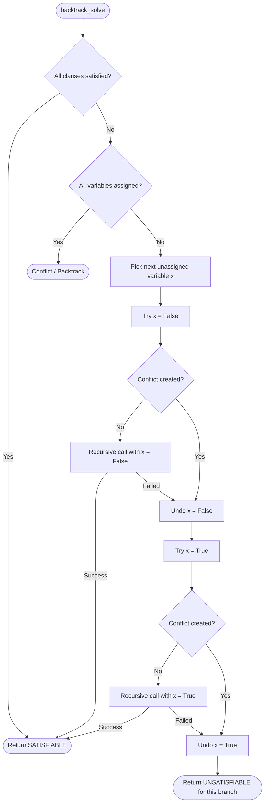

# Implementation Plan & Guide: Simulating Random 3-SAT with Backtracking

This guide and plan is designed for simulating random 3-SAT formulas and observing computational phase transitions. It is written to be fully understandable without an advanced computer science background. All computational concepts (such as stacks, trees, and pruning) are explained with everyday analogies.

---

## 1. Goal Description & Physical Motivation

In statistical physics and computer science, **Random 3-SAT** is the canonical model for studying **computational phase transitions** (as discussed in *The Nature of Computation* by Cristopher Moore and Stephan Mertens).

- We have $N$ boolean variables: $x_0, x_1, \dots, x_{N-1}$. Each variable can be either **True** ($1$) or **False** ($0$).
- We have $M$ clauses. Each clause is an "OR" of 3 literals (a variable or its negation), for example: $(x_1 \lor \neg x_3 \lor x_4)$.
- The entire formula is an "AND" of all $M$ clauses: every single clause must evaluate to **True** for the formula to be satisfied.
- The control parameter is the ratio $\alpha = \frac{M}{N}$ (clauses per variable):
  - When $\alpha < 4.2$, constraints are sparse: almost every random formula is **Satisfiable** (SAT), and finding a solution is easy.
  - When $\alpha > 4.3$, constraints are dense: almost every random formula is **Unsatisfiable** (UNSAT), and proving it has no solution can be done relatively quickly because contradictions appear near the top of the search.
  - At the critical threshold $\alpha_c \approx 4.267$, a sharp **phase transition** occurs (analogous to a magnetic or liquid-gas transition). Right at this boundary, the computational effort required by backtracking solvers spikes exponentially.

Our goal is to build:
1. An **efficient formula representation** in C tailored for backtracking.
2. A **backtracking solver** that systematically searches for satisfying assignments.
3. A **random 3-SAT formula generator**.
4. An **experiment runner** that sweeps $\alpha$, records the fraction of satisfiable formulas $P(\text{SAT})$ and the number of backtracking steps, outputting data to observe the phase transition curve and hardness peak.

---

## 2. Computer Science Concepts Explained Simply

To understand how we make the solver fast, here are intuitive explanations for the key computing terms used throughout this document:

### A. What is a "Search Tree"?
Imagine making choices one variable at a time. 
- For $x_0$, you can try $x_0 = \text{False}$ or $x_0 = \text{True}$ (2 branches).
- For each choice of $x_0$, you can try $x_1 = \text{False}$ or $x_1 = \text{True}$ (4 branches total).
- Continuing for $N$ variables creates a branching structure that looks like an upside-down tree with $2^N$ total possible assignments at the bottom (the "leaves").

### B. What is "Backtracking"?
Think of solving a maze:
1. You walk down a path. Whenever you reach a fork, you pick one direction (say, Left).
2. You keep walking. If you hit a **dead end** (a clause is violated and cannot be satisfied), you don't start the whole maze over from the entrance!
3. Instead, you **step backward** (backtrack) to the most recent fork and try the other direction (Right).
4. If both directions from that fork lead to dead ends, you step backward even further to the previous fork.

```
                  Start (No variables set)
                         │
                 [Try x0 = False]
                  /             \
       [Try x1 = False]     [Try x1 = True]
             /
    [Try x2 = False]  --> DEAD END! (Clause violated)
             │
             └─── BACKTRACK! Undo x2 = False, try x2 = True.
```

### C. What is "Pruning"?
A naive algorithm would test all $2^N$ combinations one by one. For $N = 50$, $2^{50} \approx 1.1 \times 10^{15}$, which would take years to check.
**Pruning** means cutting off entire branches of the search tree early:
- Suppose after setting just $x_0 = \text{False}$ and $x_1 = \text{True}$, a clause like $(x_0 \lor \neg x_1 \lor x_0)$ becomes completely False.
- We immediately know that **no matter what values we pick for $x_2, x_3, \dots, x_{49}$**, that clause will still be False!
- We immediately prune (abandon) all $2^{48}$ combinations below this point and backtrack instantly. This is why backtracking is millions of times faster than brute force.

### D. What is a "Stack"?
A **stack** is like a physical stack of plates on a table:
- You can put a new plate on the very top (**Push**).
- You can only take away the plate that is currently on the very top (**Pop**).
- This is called **LIFO** (*Last-In, First-Out*): the most recent item added is the first one removed.
- **Why do we use it in backtracking?** The stack serves as our **Undo History**. Every time we assign a variable, we push that decision onto the stack. When we hit a dead end, we pop the top decision off the stack to cleanly undo it and return to the previous state.

### E. What is an "Occurrence List" (or "Inverted Index")?
Think of the index at the back of a textbook:
- Without an index, if you want to find every page mentioning "Entropy", you would have to read the book from page 1 to the end.
- With an index, you look up "Entropy" and immediately see: *Pages 14, 88, 203*.
- In 3-SAT, each literal (e.g., $+x_3$ or $\neg x_3$) keeps a list of which clauses contain it. When variable $x_3$ changes, we **only check the few clauses in its index**, rather than scanning through all $M$ clauses in the entire formula.

---

## 3. How to Represent Formulas Efficiently for Backtracking

When backtracking explores thousands or millions of branches per second, two things kill performance:
1. **Scanning all $M$ clauses at every step** to see if any are violated (too slow).
2. **Allocating or copying memory during search** (causes memory thrashing and cache misses).

To eliminate both bottlenecks, we use the following efficient design:

### 1. Integer Encoding of Literals (No strings, no pointers)
A variable $x_i$ has two forms: positive ($x_i$) and negative ($\neg x_i$). We map them to non-negative integers:
- Variable index: $i \in \{0, 1, \dots, N-1\}$
- Positive literal $+x_i \implies 2 \times i$ (always an even number)
- Negative literal $\neg x_i \implies 2 \times i + 1$ (always an odd number)

**Why this is great**:
- To flip a literal (negation): simply flip the last bit: `neg_lit = lit ^ 1`.
  - For example, if $x_2$ is literal `4`, its negation $\neg x_2$ is `4 ^ 1 = 5`.
- To get the variable index: integer divide by 2: `var = lit >> 1`.
- We have exactly $2N$ possible literals, which can directly index into standard arrays!

### 2. Contiguous Clause Storage
Each clause consists of exactly 3 literals:
```c
typedef struct {
    int lits[3]; // The 3 literals in this clause, e.g. {2, 7, 10}
} Clause;
```
All $M$ clauses are stored in one single flat array: `Clause *clauses`.

### 3. Occurrence Lists (The "Textbook Index")
For each of the $2N$ literals, we store an array of clause indices where that literal appears:
- `pos_clauses[var]`: list of clauses containing $+x_{\text{var}}$
- `neg_clauses[var]`: list of clauses containing $\neg x_{\text{var}}$

When variable $x_{\text{var}}$ is assigned, we only examine these specific clauses!

### 4. Tracking Clause State in $O(1)$ Time
For each clause $c \in \{0, \dots, M-1\}$, we maintain two small numbers:
1. `sat_count[c]`: How many literals in clause $c$ are currently **True**. If `sat_count[c] > 0`, this clause is satisfied!
2. `false_count[c]`: How many literals in clause $c$ are currently **False**.
   - If `false_count[c] == 3`, all three literals are False! This clause is **violated** $\implies$ **Dead End detected instantly!**

### 5. The Assignment Trail (Our Stack for Instant Backtracking)
We maintain:
- `int val[N]`: Current assignment of each variable (`-1` = unassigned, `0` = False, `1` = True).
- `int trail[N]`: A stack array recording the order in which variables were assigned.
- `int trail_size`: Number of variables currently assigned.

**When assigning variable $x_v = \text{True}$**:
1. Push $x_v$ onto the trail stack: `trail[trail_size++] = v`.
2. Set `val[v] = 1`.
3. For each clause $c$ containing $+x_v$: increment `sat_count[c]`.
4. For each clause $c$ containing $\neg x_v$: increment `false_count[c]`. If `false_count[c] == 3`, we hit a conflict!

**When backtracking (unassigning $x_v$)**:
1. Pop $x_v$ from the trail stack: `v = trail[--trail_size]`.
2. Set `val[v] = -1`.
3. Reverse the counts: decrement `sat_count[c]` for positive clauses, and decrement `false_count[c]` for negative clauses.
4. **Zero memory is allocated or freed. Everything runs directly in pre-allocated arrays.**

---

## 4. The Backtracking Algorithm: Step-by-Step

Here is the exact algorithm flow:



### Pseudocode for the Backtracking Function:
```text
function solve(depth):
    if all clauses are satisfied:
        return TRUE (formula is SAT)
        
    if all variables are assigned (and not all clauses satisfied):
        return FALSE (dead end)

    pick an unassigned variable x
    
    // --- Branch 1: Try assigning x = FALSE ---
    assign(x, FALSE)
    if no clause has 3 false literals:
        if solve(depth + 1) == TRUE:
            return TRUE
    undo_assignment(x) // Backtrack!
    
    // --- Branch 2: Try assigning x = TRUE ---
    assign(x, TRUE)
    if no clause has 3 false literals:
        if solve(depth + 1) == TRUE:
            return TRUE
    undo_assignment(x) // Backtrack!
    
    return FALSE // Both branches failed, step back up
```

---

## 5. Proposed Code Structure

We will organize the code into clean, modular C files:

### File Breakdown:
1. `sat.h`: Data structures (`Clause`, `Formula`, `SolverState`), function declarations, and inline helper functions for literals.
2. `sat.c`:
   - Formula memory management (`create`, `free`).
   - Occurrence list building.
   - Random 3-SAT generator.
   - The backtracking solver with conflict detection, trail stack, and backtracks counter.
3. `main.c`:
   - Command-line interface with two execution modes:
     - **Mode 1 (Single solve)**: Solve one generated instance, display the satisfying assignment (or UNSAT), and report total backtracks.
     - **Mode 2 (Sweep experiment)**: Sweep $\alpha = M/N$ across a range (e.g., $3.0$ to $5.5$), run $K$ trials per ratio, and print/export the phase transition curve.
4. `Makefile`: Fast compilation with `-O3` optimizations.
5. `plot_transition.py` (optional): A simple Python script using `matplotlib` to plot $P(\text{SAT})$ vs $\alpha$ and Average Backtracks vs $\alpha$.

---

## 6. Verification Plan

### Automated & Sanity Tests:
1. **Trivial SAT formula**: A formula with 1 clause $(x_0 \lor x_1 \lor x_2)$ must return SAT.
2. **Known UNSAT formula**: All 8 combinations of 3 variables:
   $(x_0 \lor x_1 \lor x_2) \land (x_0 \lor x_1 \lor \neg x_2) \dots \land (\neg x_0 \lor \neg x_1 \lor \neg x_2)$.
   The solver must return UNSAT with a known number of backtracks.
3. **Independent Solution Verifier**:
   Whenever the solver claims a formula is SAT and outputs an assignment vector, a separate verification function loops through all original clauses to verify that every single clause actually evaluates to True.
4. **Phase Transition Verification**:
   Run a sweep with $N=20$:
   - For $\alpha = 3.0$, $P(\text{SAT}) \approx 1.0$, backtracks are low.
   - For $\alpha = 4.26$, $P(\text{SAT}) \approx 0.5$, backtracks hit a sharp maximum peak.
   - For $\alpha = 5.5$, $P(\text{SAT}) \approx 0.0$, backtracks drop again.
